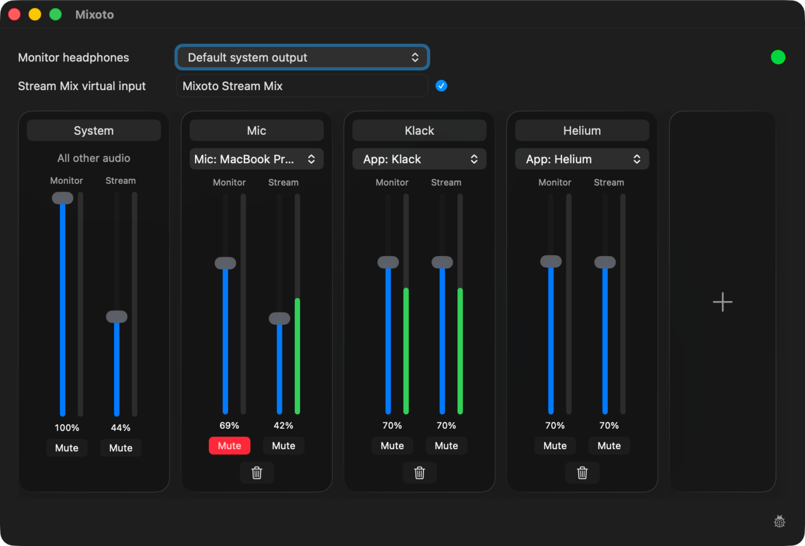

# Mixoto

A native macOS audio mixer with separate Monitor and Stream controls for apps and microphones. No Elgato hardware, OBS, or BlackHole is required.

[Download the latest release](https://github.com/coollabsio/Mixoto/releases/latest).



## Build and run

```sh
sh scripts/build-app.sh
open artifacts/Mixoto.app
```

Requires macOS 15+ and Xcode or compatible Swift tools.

## Use

1. Install the bundled virtual device from the app. Administrator access is required; audio stops briefly.
2. Add an app or microphone channel. Grant recording access when prompted.
3. Select headphones for Monitor and **Mixoto Stream Mix** as the input in your recording or call app.

Microphone channels have an effects button: **Low Cut** (80 or 120 Hz), **Voice Focus** (Apple's on-device voice isolation; adds about 60 ms of delay), and **Clipguard** on an Elgato Wave:3. The Wave:3 forgets Clipguard when unplugged; Mixoto sends it again when the microphone starts.

Use headphones to prevent microphone feedback. Live audio routing is not yet fully verified.

## Docs

- [Virtual device setup and removal](docs/virtual-device.md)
- [Verification](docs/verification.md)
- [App updates and release setup](docs/updates.md)
- [Driver and license](Driver/README.md)
